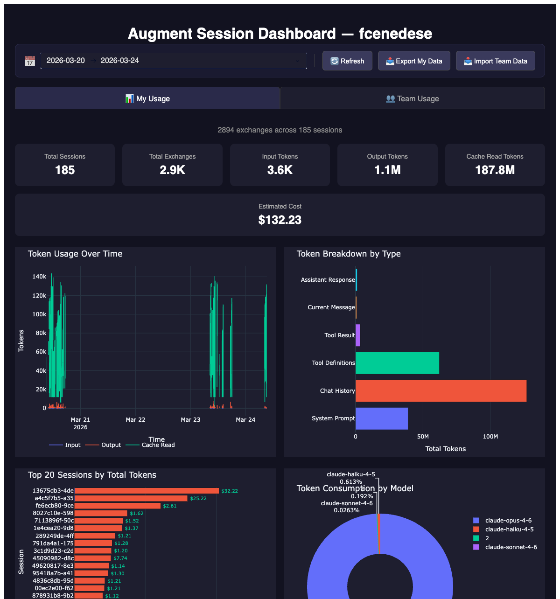
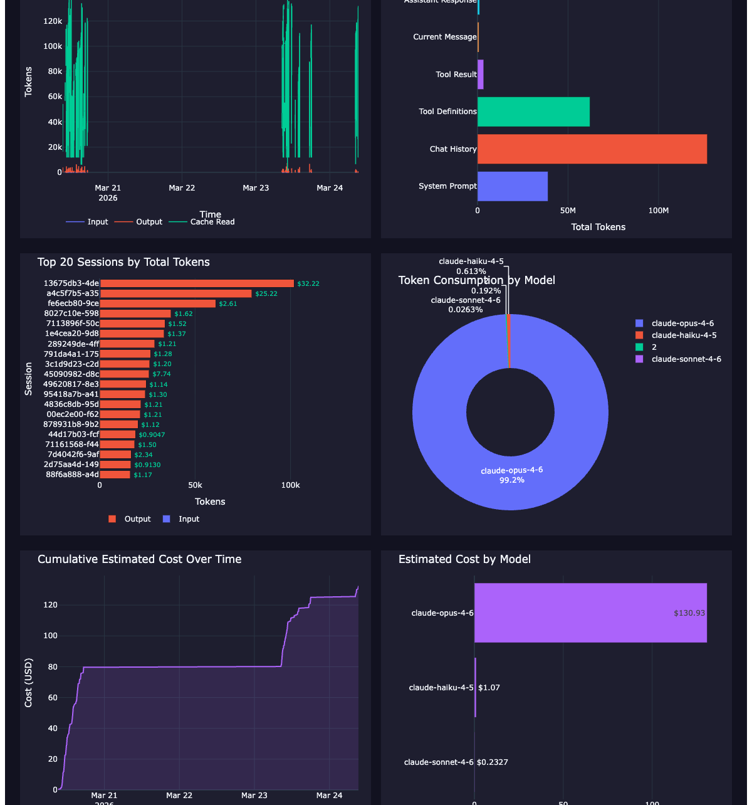
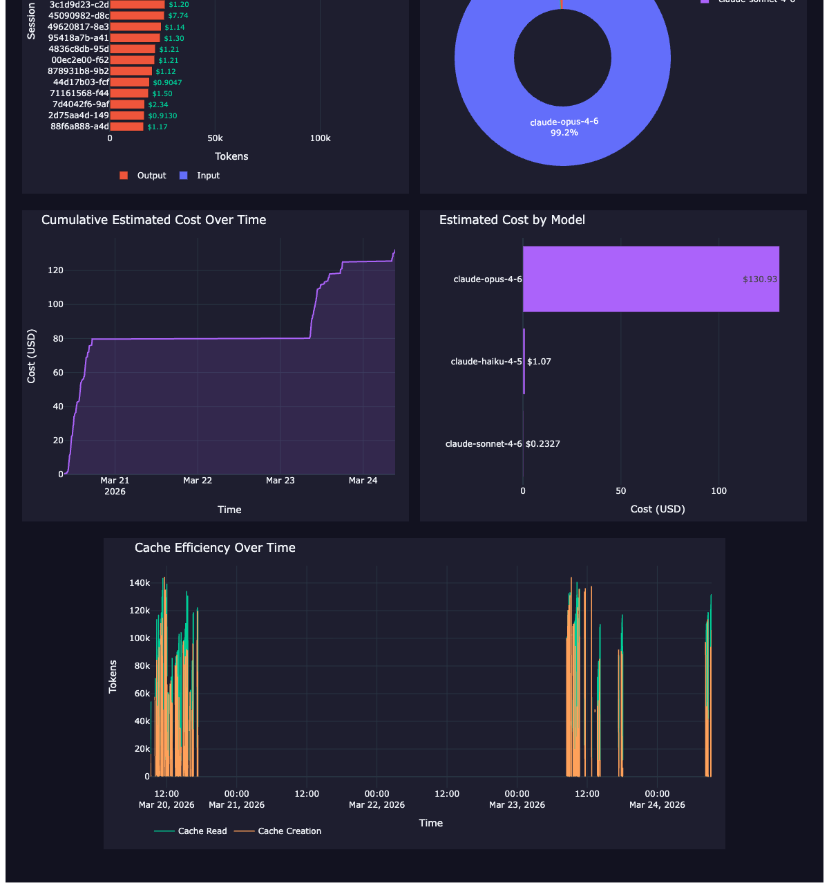
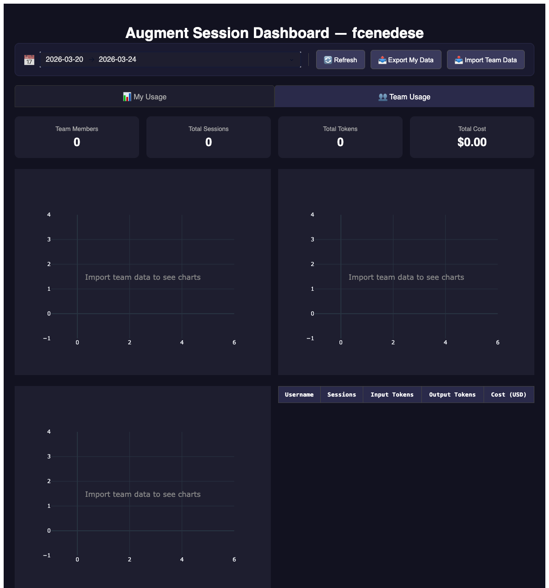

# Augment Token Usage Dashboard

A Python Dash dashboard that visualizes your Augment AI token consumption and estimated costs. Reads session data from `~/.augment/sessions/` and displays interactive charts.

## Features

- **Token usage tracking** — input, output, cache read, cache creation tokens over time
- **Cost estimation** — estimated USD costs using live pricing from [llm-prices.com](https://www.llm-prices.com/)
- **Model breakdown** — token consumption and cost by model (Claude Opus, Sonnet, Haiku)
- **Session analysis** — top sessions by token usage with cost annotations
- **Cache efficiency** — cache read vs creation patterns
- **Date range filtering** — filter all charts by date range
- **Live refresh** — reload session data without restarting
- **Export/Import** — export your usage data as JSON, import team members' data
- **Team view** — aggregated team usage tab with per-member breakdown

## Screenshots

### Dashboard Overview



### Token Usage & Breakdown



### Cost Analysis



### Team Usage Tab



## Quick Start

### Local Development

```bash
# Install dependencies
pip install -r requirements.txt

# Run the dashboard
python app.py
```

Open <[http://localhost:8050](http://localhost:8050)>

### Docker

```bash
docker compose up --build
```

Open <[http://localhost:8050](http://localhost:8050)>

The Docker setup automatically:

- Mounts `~/.augment/sessions/` read-only into the container
- Detects your username from the host
- Exposes the dashboard on port 8050

## Team Usage Workflow

1. Each team member runs the dashboard and clicks **📤 Export My Data**
2. They share their `augment-usage-{username}-{date}.json` file
3. The team lead clicks **📥 Import Team Data** and uploads all files
4. Switch to the **Team Usage** tab to see aggregated stats

## Data Source

The dashboard reads Augment session files from `~/.augment/sessions/*.json`. Each file contains chat history with token usage metadata per LLM call.

## Configuration

| Environment Variable | Default | Description |
| --- | --- | --- |
| AUGMENT_SESSIONS_DIR | ~/.augment/sessions | Path to session files |
| AUGMENT_USERNAME | Auto-detected from home dir | Username shown in dashboard |
| HOST | 127.0.0.1 | Bind address (0.0.0.0 for Docker) |

## ⚠️ Security & Privacy

**This dashboard exposes sensitive data.** Be aware of the following:

- **Session data contains your full conversation history** with Augment AI, including code snippets, file paths, and potentially secrets or credentials that appeared in your prompts
- **The exported JSON files** contain per-session token summaries (no conversation content), but do include your username and session IDs
- **The dashboard binds to **`127.0.0.1`** (localhost only) by default** — it is NOT accessible from other machines on your network
- **In Docker mode**, the compose file sets `HOST=0.0.0.0` — if your machine's firewall allows it, the dashboard could be accessible on your local network. The session data volume is mounted read-only
- **Do not deploy this to a public server** — there is no authentication, and the session data directory would be exposed
- **Exported team data files** should be shared through secure channels (not public Slack channels, not email without encryption)

**TL;DR**: Run locally only. Don't expose to the internet. Treat exported files as confidential.

## Tech Stack

- [Dash](https://dash.plotly.com/) 4.0 — Python web framework
- [Plotly](https://plotly.com/python/) 6.6 — Interactive charts
- [Pandas](https://pandas.pydata.org/) 2.2 — Data processing
- [llm-prices](https://github.com/simonw/llm-prices) — LLM pricing data

## License

MIT